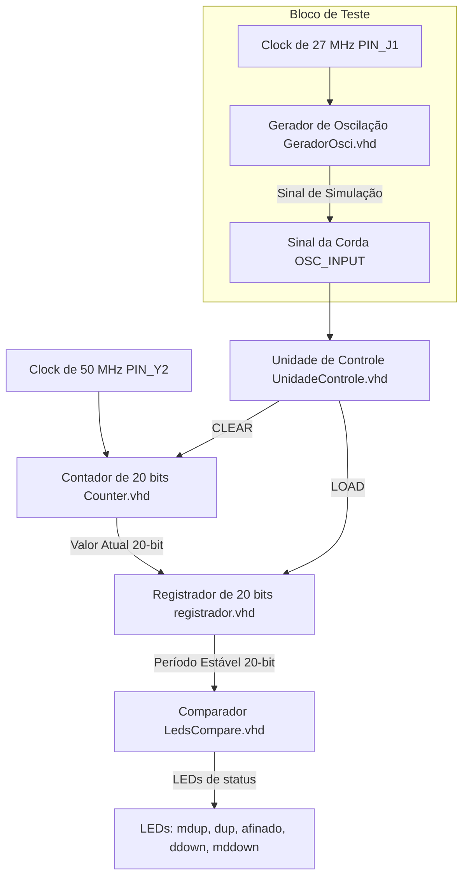

# Guia de Apresentação: Afinador de Violão no Quartus II 13

Este guia foi elaborado para que você possa entender o projeto do zero. Ele começa com um glossário conceitual para nivelar o conhecimento e depois detalha o funcionamento técnico e as possíveis perguntas de uma banca acadêmica.

---

## 📖 Dicionário de Conceitos Básicos
Antes de entrarmos no funcionamento do afinador, vamos entender as peças básicas de eletrônica digital que compõem o circuito. Este dicionário combina a **definição técnica** com uma **analogia simples** para que você possa explicar os conceitos para qualquer pessoa (leiga ou especialista).

### 1. Clock (Relógio de Sincronismo)
* **Definição Técnica:** É um sinal de onda quadrada que oscila continuamente entre nível lógico baixo ('0' ou 0V) e nível lógico alto ('1' ou VCC) a uma frequência fixa. Ele atua como a referência temporal para circuitos digitais síncronos, definindo o momento exato em que os componentes lêem dados ou mudam de comportamento (na borda de subida ou descida da onda).
* **Analogia Simples:** Pense no Clock como o **baterista de uma banda** ou o **maestro de uma orquestra**. Ele dita o ritmo (tempo) da música. Nenhum músico (componente do circuito) toca uma nota ou muda de posição fora da batida do maestro. No nosso projeto, o clock bate 50 milhões de vezes por segundo (50 MHz).

### 2. Flip-Flop
* **Definição Técnica:** É o elemento de memória síncrono fundamental em circuitos digitais. Ele é capaz de reter exatamente **1 bit** de informação ('0' ou '1'). A alteração do valor armazenado só ocorre em sincronia com a borda ativa do sinal de Clock.
* **Analogia Simples:** Imagine um **interruptor de luz inteligente** que só muda o estado da lâmpada (ligada ou desligada) se você pressioná-lo e, ao mesmo tempo, bater palmas (borda do clock). Se você tentar mudar a chave sem a batida de palmas, nada acontece. Ele "trava" a informação.

### 3. Registrador (Register)
* **Definição Técnica:** É um grupo de múltiplos Flip-Flops conectados em paralelo que operam de forma coordenada para armazenar palavras binárias de vários bits (por exemplo, 8, 16 ou 20 bits). Ele normalmente possui entradas de controle como *Enable* (que autoriza a gravação de novos dados) e *Reset* (que força todas as saídas para zero).
* **Analogia Simples:** Se o Flip-Flop é uma única lâmpada guardando ligado/desligado (1 bit), o Registrador é um **painel com várias lâmpadas** (neste projeto, 20 lâmpadas lado a lado) que guardam um número binário grande. O registrador "tira uma foto" do número de ciclos contados e exibe essa foto estática até que a unidade de controle permita tirar outra foto.

### 4. Máquina de Estados Finitos - FSM (Finite State Machine)
* **Definição Técnica:** É um modelo de circuito digital sequencial que transita por um conjunto limitado (finito) de condições internas estáveis chamadas "estados". As transições de um estado para o outro ocorrem nas bordas do clock e são controladas pelas entradas atuais e pelo estado em que o circuito já se encontra. Suas saídas dependem do estado atual (modelo Moore) ou do estado atual e das entradas (modelo Mealy).
* **Analogia Simples:** Pense em um **semáforo de trânsito**. Ele opera em uma sequência lógica estrita: Verde $\rightarrow$ Amarelo $\rightarrow$ Vermelho $\rightarrow$ Verde. Ele nunca pode estar em dois estados ao mesmo tempo, e a mudança de cor depende do tempo (entradas) e de qual cor estava acesa antes (estado anterior). A Unidade de Controle do afinador é um semáforo que coordena a gravação e a limpeza da memória.

### 5. Gerador de Oscilação / Divisor de Frequência
* **Definição Técnica:** É um circuito digital projetado para pegar um sinal de clock muito rápido e reduzir sua frequência por meio de um contador divisor, gerando na saída uma onda quadrada estável com uma frequência muito menor e controlada.
* **Analogia Simples:** Imagine que você tem uma torneira que pinga muito rápido (50 milhões de pingos por segundo). O gerador de oscilação funciona como um **balde d'água mecânico** que só vira e despeja água quando acumula exatamente 1 milhão de pingos. Dessa forma, você transformou os pingos super rápidos em um movimento lento e ritmado de balde caindo (simulando a vibração mais lenta da corda de um violão).

---

## 1. Visão Geral do Projeto
O projeto consiste em um **Afinador Digital para Instrumentos Musicais** (especificamente calibrado para a corda **Mi grave / E2** de um violão, com frequência fundamental de **82,41 Hz**). 

O circuito captura a frequência de oscilação do sinal de entrada da corda, mede o seu **período** (tempo de um ciclo completo) contando ciclos de um clock interno de alta frequência da placa FPGA (50 MHz) e indica o estado da afinação por meio de LEDs.

---

## 2. A Arquitetura e o Fluxo de Dados
O sistema funciona com base na **medição digital de período**. Em vez de contar quantos ciclos o sinal do violão dá em 1 segundo (o que exigiria uma amostragem lenta de 1 segundo para ter precisão de 1 Hz), o circuito mede o **tempo de um único período da corda** usando o clock rápido de 50 MHz da FPGA.

A arquitetura lógica principal é mostrada a seguir:

### O Caminho do Sinal:
1. Um sinal periódico (seja o simulado pelo `GeradorOsci` ou um sinal externo vindo de um microfone/captador) entra como `OSC_INPUT`.
2. A **Unidade de Controle (FSM)** monitora a borda de subida desse sinal.
3. Quando a borda de subida é detectada:
   - A FSM gera um sinal `LOAD` que salva a contagem atual do `Counter` no `Registrador`.
   - A FSM gera um sinal `CLEAR` que zera o `Counter`.
4. Durante todo o período do sinal de entrada, o `Counter` conta os ciclos do clock principal de **50 MHz**.
5. O `Registrador` armazena e estabiliza esse valor para que a comparação de LEDs não fique piscando instavelmente.
6. O bloco **LedsCompare** lê o valor armazenado (período em ciclos de clock) e acende o LED correspondente à afinação.

---

## 3. Explicação Detalhada dos Módulos (VHDL)

### A. Unidade de Controle (`UnidadeControle.vhd`)
É uma Máquina de Estados Finitos (FSM) com 3 estados (`STATE1`, `LDCD`, `STATE2`). O seu papel é coordenar o momento exato de ler o contador e limpá-lo.
* **STATE1:** Estado de espera. Fica aguardando o sinal `OSC_INPUT` ir de '0' para '1' (borda de subida).
* **LDCD (Load & Clear):** Estado de transição rápida. Ativa `LOAD_OUTPUT` e `CLEAR_OUTPUT` por exatamente um ciclo de clock. Isso faz com que o registrador salve a contagem acumulada e, logo em seguida, o contador seja zerado.
* **STATE2:** Fica aguardando o sinal `OSC_INPUT` voltar a ser '0'. Quando cai para '0', volta para o `STATE1` para reiniciar o ciclo.

> [!NOTE]
> Essa máquina de estados garante que o contador meça o período de exatamente **um ciclo completo** do sinal da corda.

### B. Contador (`Counter.vhd`)
Um contador síncrono simples de 20 bits (`contador` de 19 a 0).
* A cada pulso do clock de 50 MHz, ele incrementa 1.
* Se receber o sinal de `clear = '1'` (vindo da FSM), ele volta a zero.
* Possui uma lógica de **saturação**: se chegar ao valor máximo (`"11111111111111111111"`, ou seja, 1.048.575), ele para de contar e não volta a zero sozinho. Isso previne bugs se a frequência de entrada for muito baixa ou inexistente (sinal parado).

### C. Registrador (`registrador.vhd`)
Um registrador paralelo genérico de 20 bits com:
* **Reset assíncrono:** limpa a saída na inicialização.
* **Enable (carga síncrona):** só atualiza a saída `q` com os dados de `data` quando a Unidade de Controle envia o pulso `LOAD` (`enable = '1'`). Isso mantém a medição do período estável para o comparador de LEDs.

### D. Comparador de LEDs (`LedsCompare.vhd`)
Contém a lógica de limiares para acender os 5 LEDs de status. Ele converte o número de ciclos de clock (período) em faixas de afinação:
* **mdup** (Muito Alto / Sustenido forte): período muito curto (frequência muito alta).
* **dup** (Um pouco Alto / Sustenido leve): frequência levemente acima da referência.
* **afinado** (Afinado): frequência na faixa correta da nota Mi (82,41 Hz).
* **ddown** (Um pouco Baixo / Bemol leve): frequência levemente abaixo da referência.
* **mddown** (Muito Baixo / Bemol forte): período longo (frequência muito baixa).

### E. Gerador de Oscilação (`GeradorOsci.vhd`)
Este bloco serve como um **simulador** ou gerador de sinal de teste para a placa.
* Ele pega o clock secundário de **27 MHz** (`clock_27`) da placa e faz uma divisão de frequência baseada em um parâmetro chamado `MAX_COUNT`.
* Ao atingir `MAX_COUNT`, ele inverte o estado da saída `osc` (gerando uma onda quadrada).
* Ajustando `MAX_COUNT`, você simula o violão vibrando exatamente em 82,4 Hz para testar o circuito diretamente na placa sem precisar plugar um violão de verdade.

---

## 4. A Matemática da Afinação (Muito Importante para a Banca)
Os professores adoram perguntar **"de onde vieram estes números mágicos?"** no arquivo `LedsCompare.vhd`. Veja a demonstração passo a passo:

O clock que alimenta o contador é de **50 MHz** ($50.000.000 \text{ Hz}$).
A nota **Mi (E2)** possui frequência fundamental de **82,41 Hz**.

1. **Período ideal da nota Mi (E2) em segundos:**
   $$T = \frac{1}{f} = \frac{1}{82,41 \text{ Hz}} \approx 0,0121344 \text{ s} \quad (12,134 \text{ ms})$$

2. **Quantos ciclos de clock de 50 MHz ocorrem nesse período?**
   $$N_{\text{ideal}} = T \times F_{\text{clock}} = 0,0121344 \text{ s} \times 50.000.000 \text{ Hz} \approx 606.722 \text{ ciclos}$$

Agora, veja os limites configurados no código do arquivo `LedsCompare.vhd` e as respectivas frequências equivalentes calculadas pela fórmula $f = \frac{50.000.000}{N}$:

| Sinal LED | Limite do Contador ($N$) no VHDL | Frequência Equivalente ($f$) | Significado Lógico |
| :--- | :--- | :--- | :--- |
| **mdup** | $N < 599.776$ | $f > 83,36 \text{ Hz}$ | Muito Alto (Sustenido Forte) |
| **dup** | $599.776 \leq N < 604.996$ | $82,65 \text{ Hz} < f \leq 83,36 \text{ Hz}$ | Um Pouco Alto (Sustenido Leve) |
| **afinado** | $604.996 \leq N < 608.500$ | $82,17 \text{ Hz} \leq f \leq 82,65 \text{ Hz}$ | **Afinado (Ideal: 82,41 Hz)** |
| **ddown** | $608.500 \leq N < 613.795$ | $81,46 \text{ Hz} \leq f < 82,17 \text{ Hz}$ | Um Pouco Baixo (Bemol Leve) |
| **mddown** | $N > 613.795$ | $f < 81,46 \text{ Hz}$ | Muito Baixo (Bemol Forte) |

> [!TIP]
> A janela de afinação correta do circuito é de **82,17 Hz a 82,65 Hz**. Uma tolerância de apenas **0,48 Hz** de largura. Isso confere alta precisão ao afinador!

---

## 5. Possíveis Perguntas da Banca e Como Responder

### Q1: Por que vocês escolheram medir o "Período" do sinal em vez de contar a "Frequência"?
* **Resposta Curta:** Por causa da resolução e tempo de resposta para frequências baixas.
* **Explicação Completa:** A nota Mi (82,4 Hz) é uma frequência de áudio muito baixa. Se medíssemos a frequência diretamente (contando pulsos do violão durante um intervalo de tempo fixo), para conseguir uma precisão de $0,1\text{ Hz}$, precisaríamos de uma janela de tempo de amostragem de **10 segundos** (inviável para um afinador em tempo real). Medindo o período (contando pulsos de 50 MHz dentro de 1 ciclo da nota), conseguimos uma precisão de frações de Hertz quase instantaneamente (em apenas $12\text{ ms}$, que é a duração de um ciclo da nota).

### Q2: Como o circuito lida com ruído ou se a corda parar de vibrar (sem sinal)?
* **Resposta:** O contador possui lógica de saturação. Se o sinal parar ou demorar muito para subir (`OSC_INPUT`), o contador atinge o limite máximo de 20 bits (`1048575` ciclos de clock, o que equivale a $\approx 21\text{ ms}$ de espera, ou $47,6\text{ Hz}$) e para de contar, evitando que o número "estoure" (overflow), volte a zero e acenda o LED de afinado por engano.

### Q3: Qual é o papel da Unidade de Controle (FSM)? Não daria para ligar o sinal direto no contador?
* **Resposta:** Não, pois a medição precisa ser sincronizada. Se ligássemos direto, o contador não saberia quando começar e quando parar a medição. A FSM garante a sincronização exata ao detectar o início de um novo período (borda de subida do sinal), ativando primeiro o `LOAD` para salvar a medição anterior no registrador, e depois o `CLEAR` para reiniciar a contagem no contador para o ciclo atual, de forma limpa e síncrona.

### Q4: Por que usar um Registrador entre o Contador e o Comparador de LEDs?
* **Resposta:** Se ligássemos o contador diretamente no comparador de LEDs, os LEDs ficariam piscando ou mostrando valores instáveis enquanto o contador estivesse subindo de zero até o valor final. O registrador funciona como uma "memória" temporária (latch) que só atualiza o valor do período na saída quando a contagem termina. Isso mantém a indicação nos LEDs estável e de fácil leitura para o usuário.

### Q5: O projeto suporta outras notas/cordas do violão?
* **Resposta:** Da forma que está no código atual do arquivo `LedsCompare.vhd`, ele é calibrado especificamente para a corda Mi grave (E2, ~82,4 Hz). Para suportar outras cordas, teríamos que mudar os valores limiares das constantes no VHDL ou colocar um multiplexador com chaves seletoras na placa para escolher faixas de contagem diferentes para cada corda (Lá, Ré, Sol, Si, Mi agudo).
